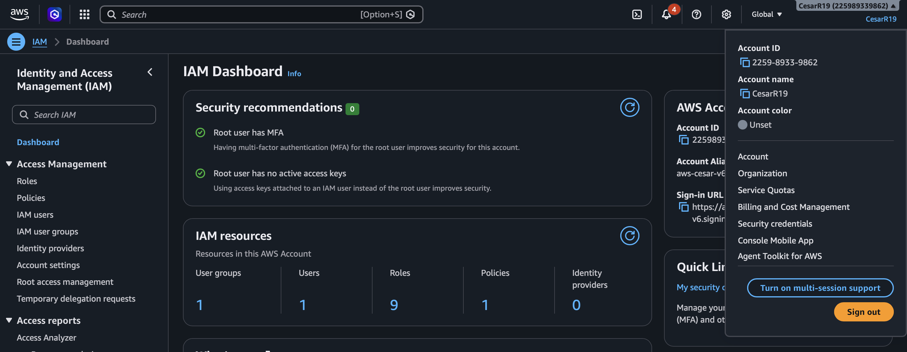
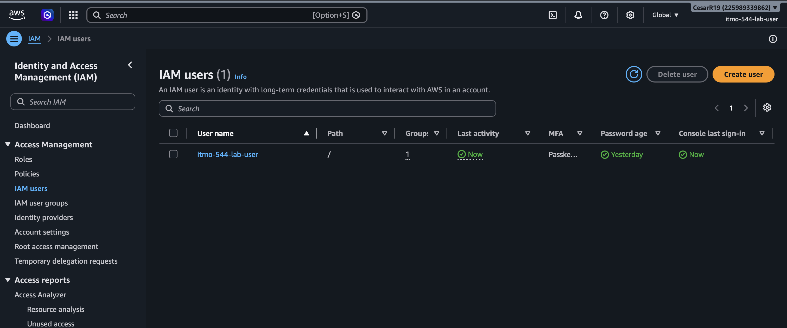
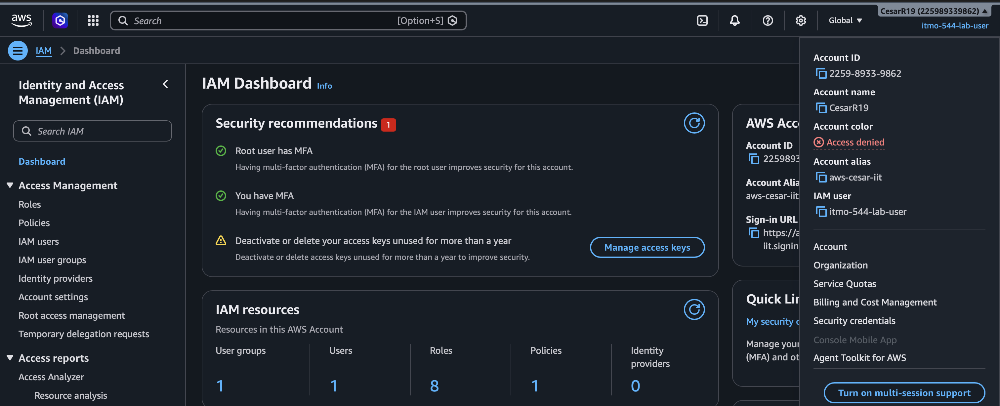

# Tool Set Up

## (1) IAM Dashboard showing “MFA on root user:Enabled”

## (2) IAM Users list showing your lab user

## (3) MFA enabled on the IAM user

## (4) Confirmation of successfully generated an access key

### Access key ID created: AKIA...FXOL
### Secret Access Key: .......

## (5) why does root user MFA and least-privilege IAM users matter for cloud security?

root user MFA matters because the root user holds admin privilege to all sources in the cloud (has full acess), this can be specially dangerous if there's only one security layer securing the root account (User and Password), by enabling MFA on the root account it adds another extra layer of security against known cyber threats like brute force attacks. Even if the penetrator were to have access to the root user password they would still need to show a second authentication method like accessing a third party app associated with the account to prove their identity or by showing some type of biometrics to confirm their identity. In the other hand, least-privilege IAM user matter for cloud security because it enables the organization to have control over what certain types of users have access to, by using the principle of least privilege nor only can the organization know what each user is allow to do or not but they can also reduced the severity or a cyber attack in case one of the IAM users account were to be exposed by limiting on how much they can or can't do within the cloud. 

