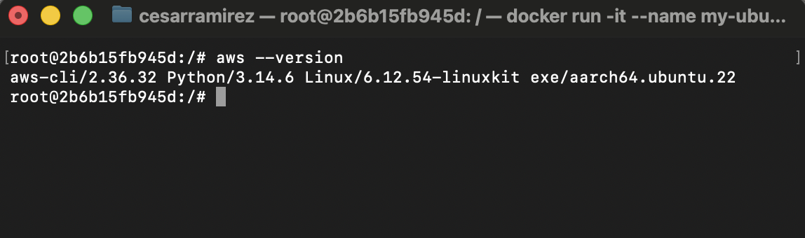
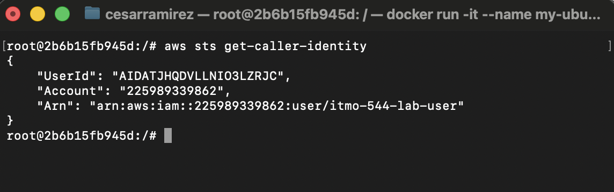
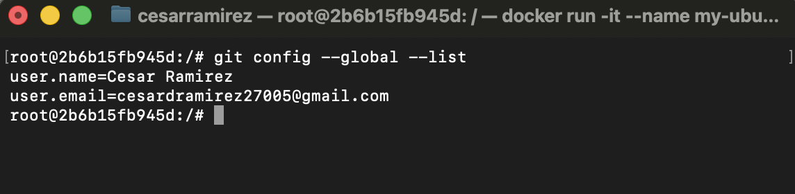
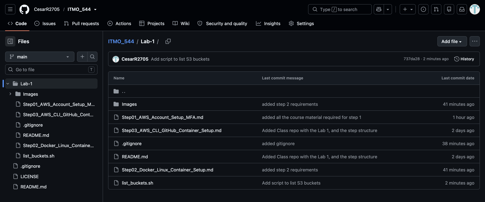

# AWS CLI GitHub Container Setup

## (1) aws --version output

## (2) aws sts get-caller-identity showing your IAM username in the ARN

## (3) git config --global --list showing your name and college email

* added personal email instead of school email, my github was created with my personal email.

## (4) GitHub repository showing list_buckets.sh successfully pushed

## (5) why you should never commit AWS credentials or GitHub tokens to a repository, even a private one?

you should never commit AWS credential or Github tokens to a public or even private remote repository because such credentials must best treated as passwords (private only to you). You must be really cautious about publishing or saving credentials on plain files and accidently pushing them into github because a malicious actor could then use these credentials to gain unathorized access to the resources they come from, examples include: your AWS account resources, your github account among others. Even if the repository is private theres a risk someone could gain access to them or contributors of the same repo could use such. Tip: In case scenario this happens to you login into the account you generated the key or key pair from and delete and swap the key for a new one to avoid further risk. 