# Tool Set Up

## (1) IAM Dashboard showing “MFA on root user:Enabled”

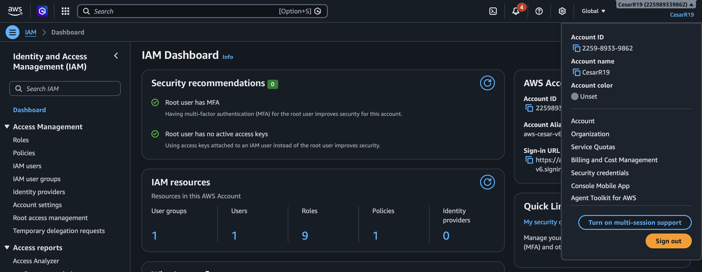

## (2) IAM Users list showing your lab user

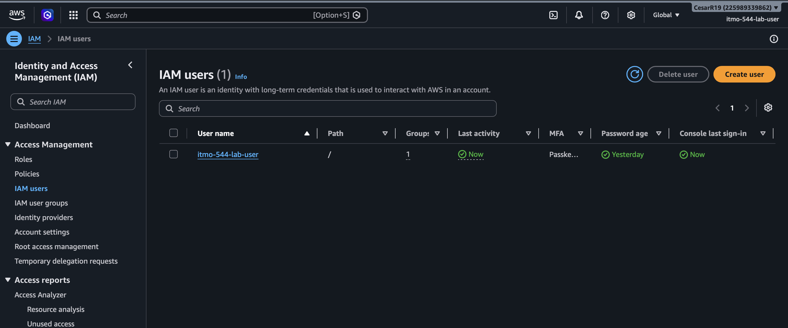

## (3) MFA enabled on the IAM user

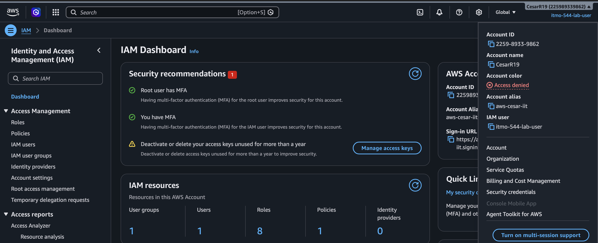

## (4) Confirmation of successfully generated an access key

### Access key ID created: AKIA...FXOL
### Secret Access Key: .......

## (5) why does root user MFA and least-privilege IAM users matter for cloud security?
root user MFA matters because the root user holds admin privilege to all sources in the cloud (has full acess), this can be specially dangerous
if there's only one security layer securing the root account (User and Password), by enabling MFA on the root account it adds another extra layer of
security against known cyber threats like brute force attacks. Even if the penetrator were to have access to the root user password they would still 
need to show a second authentication method like accessing a third party app associated with the account to prove their identity or by showing some type 
of biometrics to confirm their identity. In the other hand, least-privilege IAM user matter for cloud security because it enables the organization to have 
control over what certain types of users have access to, by using the principle of least privilege nor only can the organization know what each user is allow 
to do or not but they can also reduced the severity or a cyber attack in case one of the IAM users account were to be exposed by limiting on how much they can 
or can't do within the cloud. 

# Docker Linux Container Setup

## (1) Docker version output

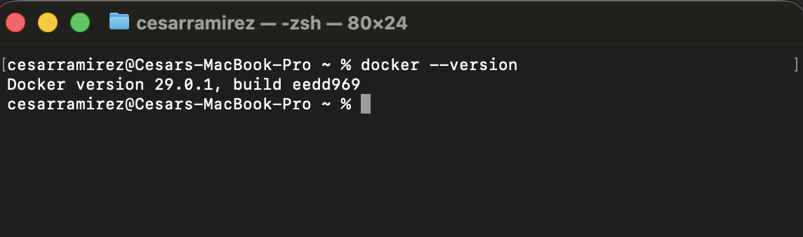

## (2) Hello World container output

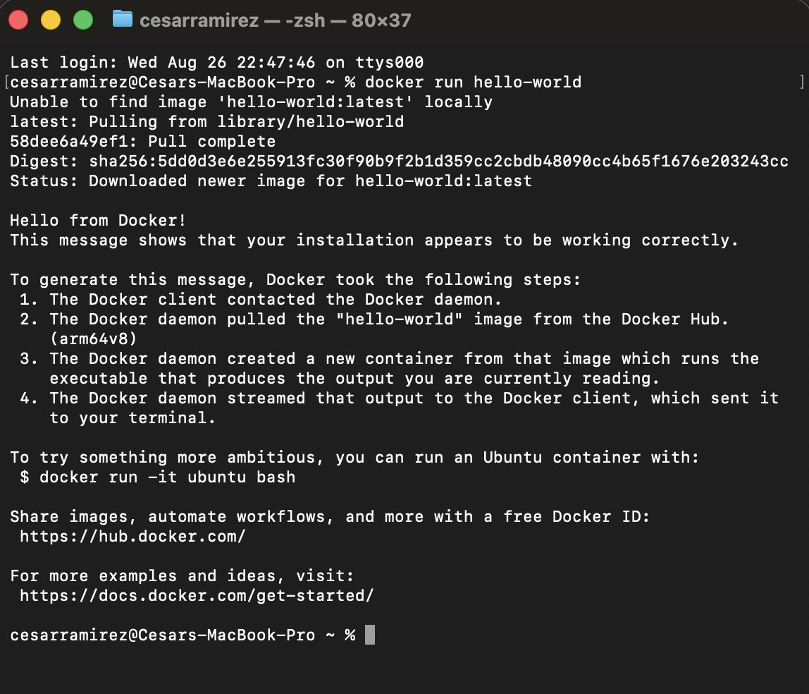

## (3) cat /etc/os-release output inside ubuntu container
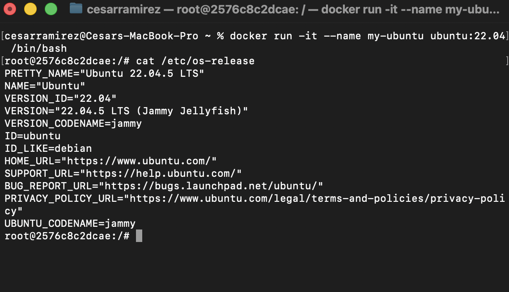

## (4) docker ps -a before and after removing my-ubuntu 

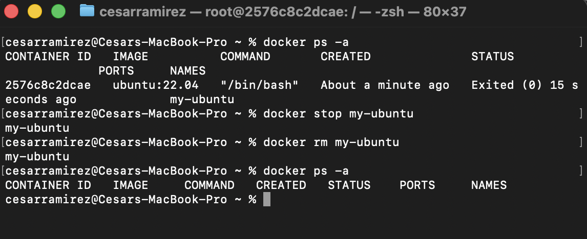

## (5) What's the difference between a Docker image and a Docker container?

The difference between a docker image and a docker container is that the docker image is like a blueprint, a static file with all the requiments listed in order to
build a docker container, so you can use this docker image (file) to create a docker container or multiple docker containers from it (a running container). In the 
other hand a docker container is simply a lighweight running instance (bundle of an applications depedencies, its own file system, network and processes).

# AWS CLI GitHub Container Setup

## (1) aws --version output
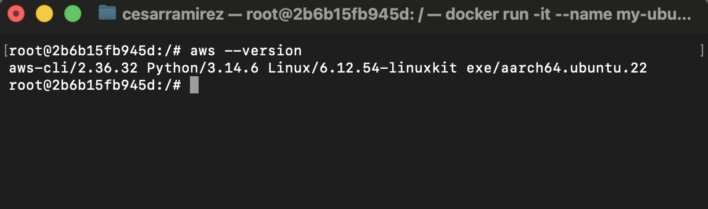

## (2) aws sts get-caller-identity showing your IAM username in the ARN

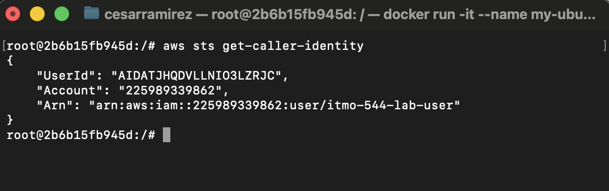

## (3) git config --global --list showing your name and college email

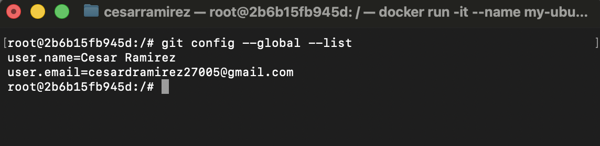

* added personal email instead of school email, my github was created with my personal email.

## (4) GitHub repository showing list_buckets.sh successfully pushed

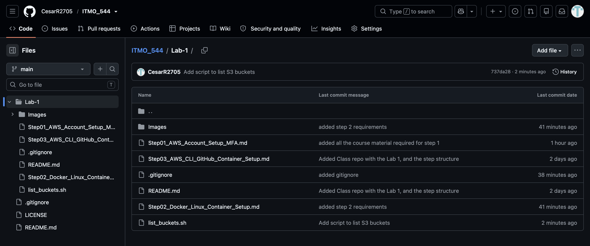

## (5) why you should never commit AWS credentials or GitHub tokens to a repository, even a private one?

you should never commit AWS credential or Github tokens to a public or even private remote repository because such credentials must best treated as passwords (private 
only to you). You must be really cautious about publishing or saving credentials on plain files and accidently pushing them into github because a malicious actor could then
use these credentials to gain unathorized access to the resources they come from, examples include: your AWS account resources, your github account among others. Even if the 
repository is private theres a risk someone could gain access to them or contributors of the same repo could use such. Tip: In case scenario this happens to you login into the 
account you generated the key or key pair from and delete and swap the key for a new one to avoid further risk. 

