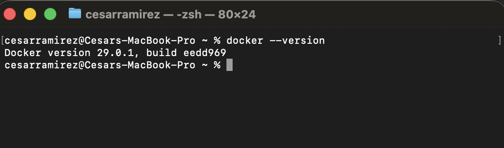
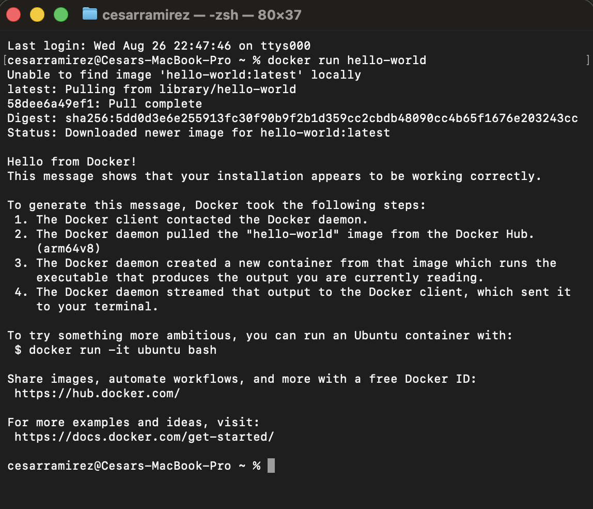
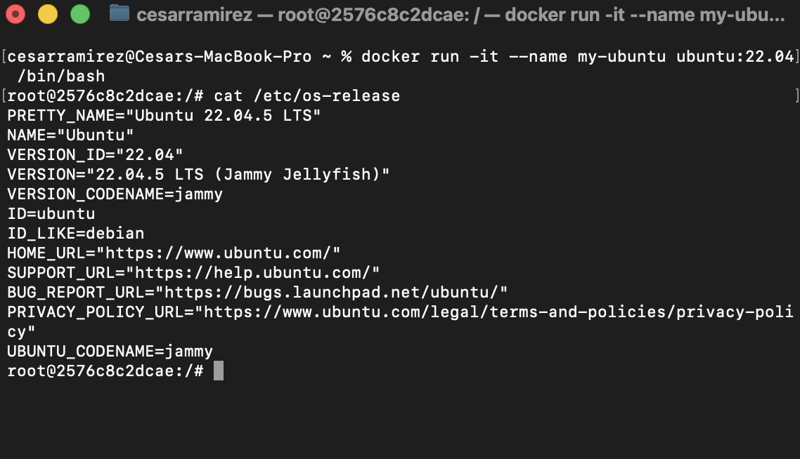
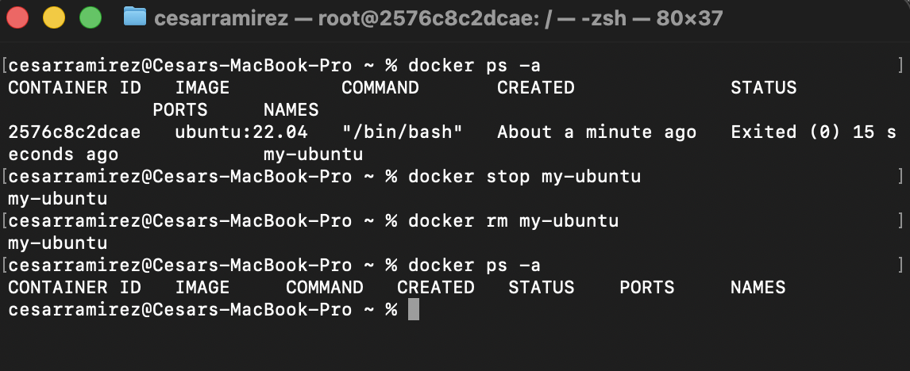

# Docker Linux Container Setup

## (1) Docker version output

## (2) Hello World container output

## (3) cat /etc/os-release output inside ubuntu container

## (4) docker ps -a before and after removing my-ubuntu 

## (5) What's the difference between a Docker image and a Docker container?

The difference between a docker image and a docker container is that the docker image is like a blueprint, a static file with all the requiments listed in order to build a docker container, so you can use this docker image (file) to create a docker container or multiple docker containers from it (a running container). In the other hand a docker container is simply a lighweight running instance (bundle of an applications depedencies, its own file system, network and processes).