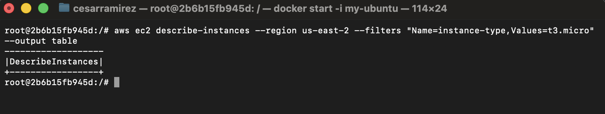
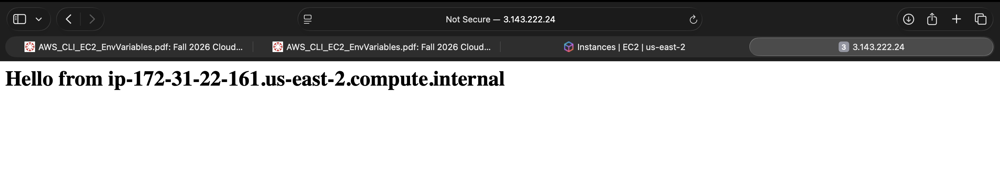
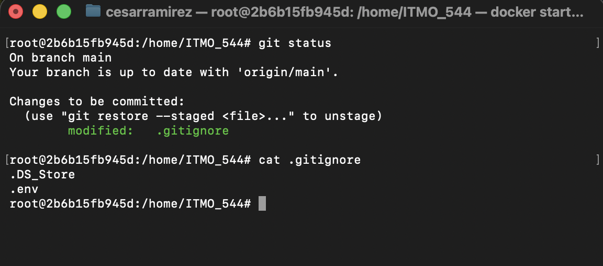
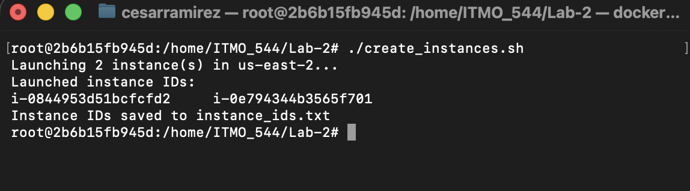
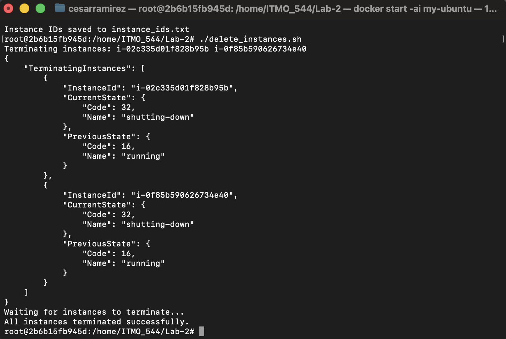

# AWS CLI Syntax, Launching EC2 Instances, and Environment-Based Scripting

## (1) Screenshot of a decomposedaws ec2 describe-instances command.

## (2) Screenshot of the “Hello from…” web page from Example 2.

## (3) Screenshot of git status showing .env is not tracked, alongside your .gitignore file contents.

## (4) Screenshot of create_instances.sh output showing 2 instance IDs.

## (5) Screenshot of delete_instances.sh output confirming termination.

## (6) why environment files are excluded from Git, even in a “private” repository?

Environment files have to be excluded on a remote repo, whether is public or private because they often have sensitive credentials that other users shouldn't have access to. In this case scenario, the env file is composed of soft credentials like AWS_REGION to sensitive credentials like KEY_NAME which is a keypair to gain remote acess to the ec2 instance, this could pose a security risk if this key were to be used by another person other than the legitimate user, gaining remote access to the ec2 instance without a restriction at all over the virtual machine. It is highly important to keep environment files in the local machine only, without exposure to the public internet or to repositories where access is shared among contributors to avoid security risks over AWS resources (in this case scenario).